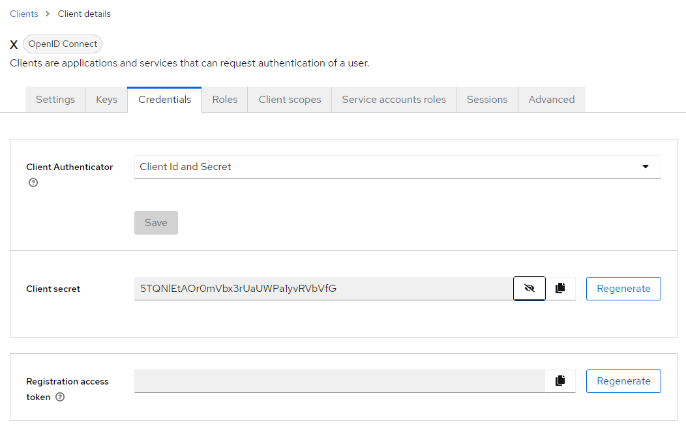
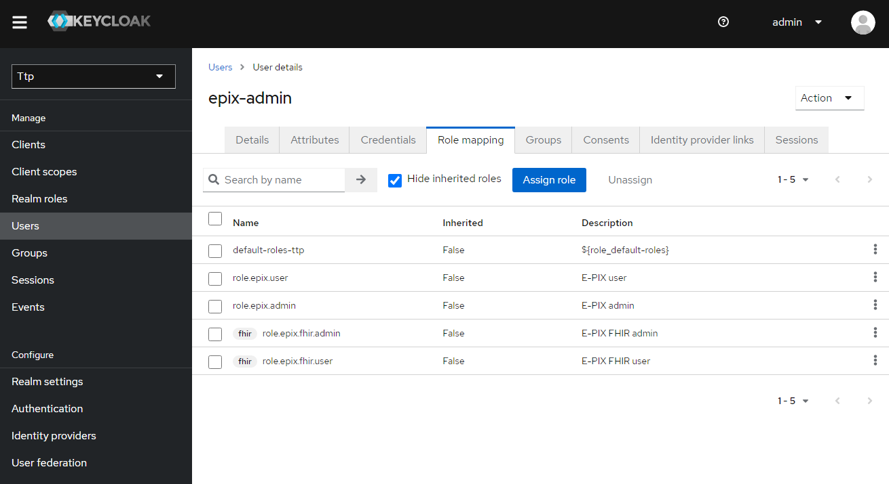

${ttp.epix.readme.header}

# Absicherung der THS-Schnittstellen mit **Keycloak**-basierter Authentifizierung

Mit dem Herbstrelease 2022 können nun **alle** THS-Schnittstellen (**WEB**-Oberfläche, 
**FHIR**-Gateway und **SOAP**-Webservices) je Endpunkt und somit je Werkzeug (**E-PIX**, 
**gICS** und **gPAS**) mit **Keycloak**-basierter (und damit 
[**OIDC**](https://openid.net/connect/)-konformer) Authentifizierung abgesichert werden.

Dies ist eine Anleitung für die Installation, die Einrichtung, den Test und die Benutzung eines 
**Keycloak**-Servers für die **THS-Tools**, sowie für die Konfiguration und Benutzung der drei 
Schnittstellen der Werkzeuge mit **Keycloak**-basierter Authentifizierung:

- [Einrichtung von Keycloak für die **THS-Tools**](#einrichtung-von-keycloak-f%C3%BCr-die-ths-tools)
  - [0. Installation und Start von Keycloak](#0-installation-und-start-von-keycloak)
  - [1. Realm `ttp` hinzufügen](#1-realm-ttp-hinzuf%C3%BCgen)
  - [2. Clients einrichten](#2-clients-einrichten)
  - [3. Rollen anlegen](#3-rollen-anlegen)
  - [4. User anlegen und Rollen zuweisen](#4-user-anlegen-und-rollen-zuweisen)
  - [5. Test und Benutzung von Keycloak](#5-test-und-benutzung-von-keycloak)
  - [6. Export des `ttp`-Realms](#6-export-des-realms)
- [Konfiguration der THS-Tools](#konfiguration-der-ths-tools)
  - [Anpassung der Rollennamen](#anpassung-der-rollennamen)
  - [Verbindungseinstellungen](#verbindungseinstellungen)
  - [Aktivierung der Authentifizierung](#aktivierung-der-authentifizierung)
    - [Web-Oberfläche](#web)
    - [FHIR-Gateway](#fhir)
    - [SOAP-Webservices](#soap)
- [Test und Benutzung der Schnittstellen mit Authentifizierung](#test-und-benutzung-der-schnittstellen-mit-authentifizierung)
  - [Web-Oberfläche](#web-oberfl%C3%A4che)
    - [Bedeutung der Admin-Rolle im Web](#bedeutung-der-admin-rolle-im-web)
  - [FHIR-Gateway](#fhir-gateway)
    - [Bedeutung der Admin-Rolle im FHIR-Gateway](#bedeutung-der-admin-rolle-im-fhir-gateway)
      - [Variante 1: Verzicht auf Angabe einer Admin-Rolle](#variante-1-verzicht-auf-angabe-einer-admin-rolle)
      - [Variante 2: Angabe einer gültigen Admin-Rolle](#variante-2-angabe-einer-g%C3%BCltigen-admin-rolle)
  - [SOAP-Webservices](#soap-webservices)
    - [Bedeutung der Admin-Rolle in SOAP-Webservices](#bedeutung-der-admin-rolle-in-soap-webservices)
- [Credits ](#credits-keycloak-for-for-ttp-tools-and-ttp-fhir-gateway)
- [License](#license)

## Einrichtung von **Keycloak** für die **THS-Tools**

### 0. Installation und Start von **Keycloak**

**Keycloak** wird als Container-Image für  [**Docker**](https://www.docker.com) angeboten. 
Wenn nicht schon geschehen, dann muss also zuerst **Docker** installiert werden,
z.B. [**Docker Desktop**](https://www.docker.com/products/docker-desktop).

Gemäß dieser [Anleitung](https://www.keycloak.org/getting-started/getting-started-docker) 
kann dann [**Keycloak**](https://www.keycloak.org/) in **Docker** installiert werden.
(Das Beispiel-**Realm** `myrealm` braucht dabei natürlich nicht angelegt zu werden.)

Wenn die **THS-Tools** und der **Keycloak**-Server auf der gleichen Maschine laufen sollen,
ist zu beachten, dass beiden Anwendungen verschiedene Ports zugewiesen werden. Wenn durch die 
**THS-Tools** z.B. der Port _8080_ schon belegt ist, müsste **Keycloak** einen anderen Port nutzen, 
z.B. _8081_, was beim Start des Containers beachtet werden muss:

```shell
docker run -p 8081:8080 -e KEYCLOAK_ADMIN=admin -e KEYCLOAK_ADMIN_PASSWORD=admin quay.io/keycloak/keycloak:19.0.3 start-dev
```

In der Standardinstallation von **Keycloak** darf der zweite Port in `-p 8081:8080` nicht 
verändert werden, über den ersten Port (im weiteren `{KEYCLOAK_PORT}` genannt) wird **Keycloak** 
auf dem Dockerhost angesprochen.

Zum Einrichten von **Keycloak** startet man dessen Admin-Konsole unter 

[http://`{KEYCLOAK_HOST}`:`{KEYCLOAK_PORT}`/admin](http://localhost:8081/admin) 

und meldet sich als Benutzer `admin` mit dem zuvor vergebenen Keycloak-Admin-Passwort an.

> *Achtung:* Ab **Keycloak** v17 wird standardmäßig **kein** `/auth`-Prefix mehr in den URLs 
> verwendet, vorher enthielten alle URLs diesen Prefix: 
> _http://`{KEYCLOAK_HOST}`:`{KEYCLOAK_PORT}`/auth/..._

### 1. **Realm** `ttp` hinzufügen

Die Admin-Konsole startet im **Realm** **_Master_**, erkennbar links oben.
Dieses ist nur zur Verwaltung von **Keycloak** selbst bestimmt.
Öffnet man die Kombobox mit den **Realms**, dann kann man mit **_Create Realm_**, ein neues **Realm** 
erstellen. Das **Realm** für alle **THS-Tools** bekommt z.B. den Namen `ttp`.

### 2. Clients einrichten

Für die tokenbasierte Authentifizierung benutzt man am besten gesicherte (confidential) Clients. 
Dabei steht es einem frei, **nur einen Client** (z.B. `ths`) für alle Arten von Zugriff einzurichten, 
oder feinkörniger **für jede Zugriffsart einen eigenen Client** zu verwenden (z.B. `web`, `soap`, `fhir`). 
Als authentifizierter Client (bei Kenntnis des sogenannten Client-Secrets) darf man dann bei 
**Keycloak** Benutzertokens erfragen (*token request*) und prüfen lassen (*token introspection*).

Um Clients anzulegen, navigiert man am linken Rand zu **_Clients_**, und kommt so in den 
entsprechenden Bereich. Mit dem Button **_Create Client_** erzeugt man einen neuen Client, 
wählt als **_Client Type_** `OpenID Connect` und vergibt die gewünschte **_Client ID_**. 
Im nächsten Schritt muss für diesen Client **_Client authentication_** und **_Service accounts roles_** 
aktiviert werden - so erhält man nach **_Save_** einen `confidential` Client:


Im nächsten Schritt werden die Zugriffseinstellungen für den Client konfiguriert. Wichtig sind 
die **Root Url**, die **Home URL** und die **Valid Redirect URIs**. Für den Anfang oder zum 
Testen können erstere auch leer bleiben und für die Redirect URI kann ein `*` gesetzt werden.


Im Unterbereich **_Credentials_** (für diesen Client) findet man das zugehörige **_Client secret_**
(z.B. _5TQNlEtAOr0mVbx3rUaUWPa1yvRVbVfG_). Das wird im weiteren Verlauf noch benötigt und muss deshalb 
kopiert werden. 



Diese Prozedur wiederholt man für alle einzurichtenden Clients.

### 3. Rollen anlegen

Im einfachsten Fall arbeitet man mit **Realm**-Rollen:


Die Namen der Rollen sind standardmäßig nach einem einfachen Schema aufgebaut und für alle 
Clients bzw. Schnittstellen (**WEB**, **FHIR** und **SOAP**) gleich:

| Komponente | **_Admin-Rolle_**       | **_User-Rolle_**       |
| :--------- | :---------------------- | :--------------------- |
| gICS       | `role.gics.admin`       | `role.gics.user`       |
| gPAS       | `role.gpas.admin`       | `role.gpas.user`       |
| E-PIX      | `role.epix.admin`       | `role.epix.user`       |
| Dispatcher | `role.dispatcher.admin` | `role.dispatcher.user` |

Allerdings können die Namen der Rollen für die Absicherung der Zugriffe 
über **FHIR** und **SOAP** frei konfiguriert werden (die für **WEB** sind festgelegt).

Die Anpassbarkeit der Rollennamen erlaubt den Zugriff auf die **THS-Tools** über 
die verschiedenen Schnittstellen feinkörnig differenziert zu konfigurieren, 
inbesondere bei Verwendung clientbasierter Rollen:


Wie die Rollennamen in den **THS-Tools** konfiguriert werden können, wird später 
im [Abschnitt über deren Konfiguration](#konfiguration-der-ths-tools) beschrieben.

### 4. User anlegen und Rollen zuweisen

Nun müssen noch je Werkzeug zwei Nutzer für den Zugriff auf diese angelegt werden, 
je ein (einfacher) Benutzer und ein Administrator:


Dabei muss das Feld **_Required User Action_** leer bleiben, 
lediglich der jeweilige **_Username_** und optionale Informationen werden eingetragen.

Anschließend vergibt man für die Nutzer unter **_Credentials_** nicht-temporäre
Passwörter (die man sich natürlich merkt):


Und schließlich ordnet man den Nutzern unter **_Role Mappings_** die entsprechenden 
Rollen zu (auf jeden Fall die **Realm**-Rollen und ggf. auch die clientbasierten Rollen),
z.B.:

| Werkzeug   | **_Username_** | **_Assigned Role_**                                  |
| :--------- | :------------- | :--------------------------------------------------- |
| gICS       | `gics-user`    | `role.gics.user`, ...                                |
| gICS       | `gics-admin`   | `role.gics.user`, `role.gics.admin`, ...             |
| gPAS       | `gpas-user`    | `role.gpas.user`, ...                                |
| gPAS       | `gpas-admin`   | `role.gpas.user`, `role.gpas.admin`, ...             |
| E-PIX      | `epix-user`    | `role.e-pix.user`, ...                               |
| E-PIX      | `epix-admin`   | `role.epix.user`, `role.epix.admin`, ...             |
| Dispatcher | `disp-user`    | `role.dispatcher.user`, ...                          |
| Dispatcher | `disp-admin`   | `role.dispatcher.user`, `role.dispatcher.admin`, ... |



Das Zuordnen von clientbasierten Rollen ist etwas versteckt, dazu muss im Assign-Dialog 
**_Filter by clients_** ausgewählt werden.


### 5. Test und Benutzung von **Keycloak**

Für den Zugriff auf die durch **Keycloak** abgesicherten Komponenten über **FHIR** oder 
**SOAP** benötigt man neben den Client-Secrets auch einen **Access-Token**. Den bekommt 
man mit einem **POST**-Request vom **Keycloak**-Server (`token-request-endpoint`):

```shell
POST /realms/ttp/protocol/openid-connect/token HTTP/1.1
Host: {KEYCLOAK_HOST}:{KEYCLOAK_PORT}
Content-Type: application/x-www-form-urlencoded
Content-Length: 128

username={USERNAME}&password={PASSWORD}&grant_type=password&client_id={CLIENT_ID}&client_secret={CLIENT_SECRET}
```
> *Achtung:* ab **Keycloak** v17 ohne `/auth`-Prefix!

Hierbei wird, wie man sieht, auch das früher schon kopierte **_Secret_** des Clients benötigt. 
Die Variablen sind entsprechend zu ersetzen: beispielsweise für **gICS** wären 

- der `{USERNAME}` dann `gics-user`,
- das `{PASSWORD}`, das für `gics-user` vergebene Passwort,
- die `{CLIENT_ID}` (z.B. `fhir`)
- und das `{CLIENT_SECRET}`, das zuvor gemerkte **_Secret_** des Clients.

Mit [`curl`](https://curl.se/) könnte das etwa so aussehen:

```shell
curl -d 'username={USERNAME}&password={PASSWORD}&grant_type=password&client_id={CLIENT_ID}&client_secret={CLIENT_SECRET}' \
		http://{KEYCLOAK_HOST}:{KEYCLOAK_PORT}/realms/ttp/protocol/openid-connect/token
```
> *Achtung:* ab **Keycloak** v17 ohne `/auth`-Prefix!

...und die (hier etwas aufgehübschte) Antwort mit dem **Access-Token** darauf wäre:

```json
{
	"access_token" : "eyJhbGciOiJSUzI1NiIsInR5cCIgOiAiSldUIiwia2lkIiA6ICI1M3drWmNua0h...",
	"expires_in" : 300,
	"refresh_expires_in" : 1800,
	"refresh_token" : "eyJhbGciOiJIUzI1NiIsInR5cCIgOiAiSldUIiwia2lkIiA6ICI0NGI0YTY5MC05Y...",
	"token_type" : "Bearer",
	"not-before-policy" : 0,
	"session_state" : "a343bc8f-7616-4deb-a635-293a91556b96",
	"scope" : "email profile"
}
```

Das **Access-Token** (später `{ACCESS_TOKEN}` genannt) wird bei allen **FHIR**- und 
**SOAP**-Requests als sogenanntes **Bearer-Token** im **Authorization-Header** benötigt.

### 6. Export des **Realms**

An dieser Stelle empfiehlt es sich, die Konfiguration des **Realms** `ttp` in eine **JSON**-Datei 
zu exportieren, um sie bei Bedarf wieder importieren zu können. Zu beachten ist dabei 
allerdings, dass die angelegten Nutzer, deren Konfigurationen und die **_Client secrets_** 
**nicht** mit exportiert werden. Sie müssen nach einem Import neu erstellt bzw. neu 
generiert werden.

Ein Export des (beispielhaften) `ttp`-**Realms** mit den Clients `ths`, `web`, `fhir` und `soap`
(inklusive jeweiliger Client-Roles) ist im Dockerpaket enthalten und kann nach Import als Basis
verwendet und nach Belieben angepasst werden.

----

## Konfiguration der **THS-Tools**

Detaillierte Beschreibungen der Konfiguration der Authorisierung und deren **Keycloak**-bezogenen 
Details für die **docker-compose**-Pakete der jeweiligen Werkzeuge finden sich in der separaten 
ReadMe-Datei (`README_<TOOL>.md`). Hier folgt deshalb nur ein kurzer Überblick:

### Anpassung der Rollennamen

Wie gesagt, die Namen der Rollen für **FHIR** und **SOAP** sind frei konfigurierbar, was 
besonders sinnvoll bei der Verwendung clientbasierter Rollen ist. Die Konfiguration der 
Rollennamen kann über Docker-ENV-Variablen erfolgen:

| Standardname der Rolle | ENV-Variable in Docker für **FHIR** | ENV-Variable in Docker für **SOAP** |
| :--------------------- | :---------------------------------- | :---------------------------------- |
| `role.epix.user`       | `TTP_FHIR_KEYCLOAK_ROLE_EPIX_USER`  | `TTP_SOAP_KEYCLOAK_ROLE_EPIX_USER`  |
| `role.epix.admin`      | `TTP_FHIR_KEYCLOAK_ROLE_EPIX_ADMIN` | `TTP_SOAP_KEYCLOAK_ROLE_EPIX_ADMIN` |
| `role.gics.user`       | `TTP_FHIR_KEYCLOAK_ROLE_GICS_USER`  | `TTP_SOAP_KEYCLOAK_ROLE_GICS_USER`  |
| `role.gics.admin`      | `TTP_FHIR_KEYCLOAK_ROLE_GICS_ADMIN` | `TTP_SOAP_KEYCLOAK_ROLE_GICS_ADMIN` |
| `role.gpas.user`       | `TTP_FHIR_KEYCLOAK_ROLE_GPAS_USER`  | `TTP_SOAP_KEYCLOAK_ROLE_GPAS_USER`  |
| `role.gpas.admin`      | `TTP_FHIR_KEYCLOAK_ROLE_GPAS_ADMIN` | `TTP_SOAP_KEYCLOAK_ROLE_GPAS_ADMIN` |

Die Verwendung clientbasierter Rollen kann man (mit `true` oder `false`) auch über 
Docker-ENV-Variablen steuern:

```shell
TTP_KEYCLOAK_USE_RESOURCE_ROLE_MAPPINGS=true      # für alle Schnittstellen
TTP_FHIR_KEYCLOAK_USE_RESOURCE_ROLE_MAPPINGS=true # nur für FHIR
TTP_SOAP_KEYCLOAK_USE_RESOURCE_ROLE_MAPPINGS=true # nur für SOAP
TTP_WEB_KEYCLOAK_USE_RESOURCE_ROLE_MAPPINGS=true  # nur für WEB
```

### Verbindungseinstellungen

Die Docker-ENV-Variablen für die grundsätzlichen Einstellungen für die Verbindung zum **Keycloak**-Server :

```shell
TTP_KEYCLOAK_REALM=ttp
TTP_KEYCLOAK_CLIENT_ID={CLIENT_ID}
TTP_KEYCLOAK_SERVER_URL=http://{KEYCLOAK_HOST}:{KEYCLOAK_PORT}
TTP_KEYCLOAK_SSL_REQUIRED=none # oder external, all
TTP_KEYCLOAK_CLIENT_SECRET={CLIENT_SECRET}
TTP_KEYCLOAK_USE_RESOURCE_ROLE_MAPPINGS=false
TTP_KEYCLOAK_CONFIDENTIAL_PORT=0 # ohne confidential port oder z.B. 8443
```

Die Verbindungsparameter können auch schnittstellenspezifisch eingestellt werden, insbesondere 
die Einstellungen für die `{CLIENT_ID}` und das `{CLIENT_SECRET}` sind dabei von Bedeutung:

```shell
TTP_WEB_KEYCLOAK_CLIENT_ID=web
TTP_WEB_KEYCLOAK_CLIENT_SECRET={CLIENT_SECRET_WEB}
TTP_FHIR_KEYCLOAK_CLIENT_ID=fhir
TTP_FHIR_KEYCLOAK_CLIENT_SECRET={CLIENT_SECRET_FHIR}
TTP_SOAP_KEYCLOAK_CLIENT_ID=soap
TTP_SOAP_KEYCLOAK_CLIENT_SECRET={CLIENT_SECRET_SOAP}
```

Weitere schnittstellenspezifische Variablennamen und Details befinden sich im jeweiligen 
`README_<TOOL>.md`.

### Aktivierung der Authentifizierung

Auch die Aktivierung erfolgt über Docker-ENV-Variablen:

#### **WEB**

```shell
TTP_EPIX_WEB_AUTH_MODE=keycloak
TTP_GICS_WEB_AUTH_MODE=keycloak
TTP_GPAS_WEB_AUTH_MODE=keycloak
```

#### **SOAP**

```shell
TTP_EPIX_SOAP_KEYCLOAK_ENABLE=true
TTP_GICS_SOAP_KEYCLOAK_ENABLE=true
TTP_GPAS_SOAP_KEYCLOAK_ENABLE=true
```

#### **FHIR**

```shell
TTP_FHIR_KEYCLOAK_ENABLE=true
```

## Test und Benutzung der Schnittstellen mit Authentifizierung

### Web-Oberfläche

Test bzw. Benutzung der mit **Keycloak** abgesicherten Web-Oberfläche ist denkbar einfach: 
Der Benutzer wird an einen Login-Dialog des **Keycloak**-Servers weitergeleitet, wo er seine
Credentials (Benutzername und Passwort) eingibt. Entsprechend der Rollen des verwendeten 
Benutzers ist er dann als `admin` oder `user` authorisiert.

> Anmerkung: Anders als das **FHIR-Gateway** und die **SOAP-Webservices** kann die 
**Web-Oberfläche** alternativ **gRAS**-basiert abgesichert werden. (Details wieder dazu im 
`README_<TOOL>.md`)


#### Bedeutung der Admin-Rolle im Web

Ein detailierte Beschreibung der Aktionen im Web, die als `user` erlaubt sind und jener, 
für die die `admin`-Rolle benötigt wird, findet sich im jeweiligen Handbuch des Werkzeugs.

### **FHIR**-Gateway

Für die Benutzung des **FHIR-Gateway**, nun mit Authentifizierung über **Keycloak**, 
muss das aus dem Token-Request entnommene **Access-Token** als Authorization-Header 
`Authorization: Bearer {ACCESS_TOKEN}` bei jedem Request an das **FHIR-Gateway** 
im Header mitgegeben werden. Um die korrekte Funktion zu testen, kann man nun in einem
**GET**-Request die Metadaten der **FHIR**-Schnittstelle (z.B. für **gICS**) anfordern:

```shell
GET /ttp-fhir/fhir/gics/metadata HTTP/1.1
Host: {GICS_HOST}:{GICS_PORT}
Authorization: Bearer {ACCESS_TOKEN}
```

Mit [`curl`](https://curl.se/) könnte das für **gICS** beispielsweise so aussehen:

```shell
curl -X GET http://{GICS_HOST}:{GICS_PORT}/ttp-fhir/fhir/gics/metadata \
     --header "Authorization: Bearer {ACCESS_TOKEN}"
```

Die erwartete (hier etwas aufgehübschte) Antwort darauf sollte etwa so aussehen:

```json
{
  "resourceType": "CapabilityStatement",
  "status": "active",
  "date": "2021-06-03T20:54:47+02:00",
  "publisher": "Not provided",
  "kind": "instance",
  "software": {
    "name": "HAPI FHIR Server",
    "version": "5.0.0"
  },
  "implementation": {
    "description": "HAPI FHIR",
    "url": "http://{GICS_HOST}:{GICS_PORT}/ttp-fhir/fhir/gics"
  },
  "fhirVersion": "4.0.1",
  "format": [
    "application/fhir+xml",
    "application/fhir+json"
  ],
  "rest": [
    {
      "mode": "server",
      "resource": [
        ...
      ],
      "operation": [
        {
          "name": "allConsentsForDomain",
          "definition": "http://{GICS_HOST}:{GICS_PORT}/ttp-fhir/fhir/gics/OperationDefinition/-s-allConsentsForDomain"
        },
        ...
        }
      ]
    }
  ]
}
```

Wenn dann der **GET**-Request ohne gültigen Authorization-Header `Authorization: Bearer {ACCESS_TOKEN}`:

```shell
curl -X GET http://{GICS_HOST}:{GICS_PORT}/ttp-fhir/fhir/gics/metadata
```

auch noch einen Fehler liefert:

```
Unauthorised Access to Protected Resource (No OAuth Token supplied in Authorization Header)
```

dann bedeutet das, dass die **Keycloak**-basierte Authentifizierung für **FHIR** 
wie gewünscht funktioniert. 

#### Bedeutung der Admin-Rolle im **FHIR**-Gateway

> Anmerkung: `admin`-Rollen im **FHIR-Gateway** sind für **gICS**, **gPAS** und **E-PIX** 
vorbereitet, werden derzeit nur von **gICS** verwendet

Die Angabe einer `admin`-Rolle wird derzeit nur bei der Generierung von 
**FHIR**-*ConsentPatient-Resourcen* berücksichtigt. Da ein Consent durchaus mehrere `SignerIds` 
besitzen kann und diese Informationen nicht jedermann zugänglich sein sollten, kann der Umfang 
der im FHIR Consent Patient exportierten Identifier auf diese Weise reglementiert werden.

##### Variante 1: Verzicht auf Angabe einer Admin-Rolle

Ist keine `admin`-Rolle konfiguriert oder ist im Token keine oder eine fehlerhafte `admin`-Rolle
angegeben, wird als Identifier der *ConsentPatient-Resource* **nur die SafeSignerId** verwendet. 
Die **FHIR UUID** des *ConsentPatient* entspricht somit der **FHIR UUID** der *SafeSignerId* 
(Details dazu im [gics-Handbuch](https://ths-greifswald.de/gics/handbuch))

##### Variante 2: Angabe einer gültigen Admin-Rolle

Ist in **Keycloak** eine `admin`-Rolle konfiguriert und verweist das im Request verwendete 
Token korrekt auf diese `admin`-Rolle, enthält die *ConsentPatient-Resource* 
**ALLE für den Consent relevanten SignerIds** als separate Identifier. 
Die **FHIR UUID** des *ConsentPatient* entspricht der **FHIR UUID** der *SafeSignerId* 
(Details dazu im [gics-Handbuch](https://ths-greifswald.de/gics/handbuch)).

### **SOAP-Webservices**

Analog zum **FHIR-Gateway** muss auch für die Benutzung von **SOAP-Webservices** mit 
Authentifizierung über **Keycloak**, das aus dem Token-Request entnommene **Access-Token** 
als Authorization-Header `Authorization: Bearer {ACCESS_TOKEN}` bei jedem Request an die 
**SOAP**-Schnittstelle im Header übergeben werden werden. Um die korrekte Funktion zu testen, 
kann man nun in einem **POST**-Request beispielsweise die *SignerIdTypes* des **gICS** erfragen:

```xml
POST /gics/gicsService HTTP/1.1
Host: {GICS_HOST}:{GICS_PORT}
Authorization: Bearer {ACCESS_TOKEN}
Content-Type: application/xml
Content-Length: 268

<soapenv:Envelope 
     xmlns:soapenv="http://schemas.xmlsoap.org/soap/envelope/" 
     xmlns:cm2="http://cm2.ttp.ganimed.icmvc.emau.org/">
   <soapenv:Header/>
   <soapenv:Body>
      <cm2:listSignerIdTypes>
         <domainName>MII</domainName>
      </cm2:listSignerIdTypes>
   </soapenv:Body>
</soapenv:Envelope>
```

Mit [`curl`](https://curl.se/) könnte das für **gICS** beispielsweise so aussehen:

```xml
curl -X POST http://{GICS_HOST}:{GICS_PORT}/gics/gicsService \
     --header "Authorization: Bearer {ACCESS_TOKEN}" \
     --data \
 <soapenv:Envelope \
      xmlns:soapenv=\"http://schemas.xmlsoap.org/soap/envelope/\" \
      xmlns:cm2=\"http://cm2.ttp.ganimed.icmvc.emau.org/\"> \
   <soapenv:Header/> \
   <soapenv:Body> \
      <cm2:listSignerIdTypes> \
         <domainName>MII</domainName> \
      </cm2:listSignerIdTypes> \
   </soapenv:Body> \
 </soapenv:Envelope> \
```

Die erwartete (hier etwas aufgehübschte) Antwort darauf sollte etwa so aussehen:

```xml
<soap:Envelope xmlns:soap="http://schemas.xmlsoap.org/soap/envelope/">
	<soap:Body>
		<ns2:listSignerIdTypesResponse xmlns:ns2="http://cm2.ttp.ganimed.icmvc.emau.org/">
			<return>
				<signerIdTypes>
					<fhirID>2e040fc3-0e91-4148-a8bd-0ff2d9b25982</fhirID>
					<createTimestamp>2022-02-01T10:13:27.789+01:00</createTimestamp>
					<name>Pseudonym</name>
					<updateTimestamp>2022-02-01T10:13:27.789+01:00</updateTimestamp>
				</signerIdTypes>
			</return>
		</ns2:listSignerIdTypesResponse>
	</soap:Body>
</soap:Envelope>
```

Wenn dann der gleiche **POST**-Request ohne gültigen Authorization-Header auch noch einen Fehler liefert:

```xml
<soap:Envelope xmlns:soap="http://schemas.xmlsoap.org/soap/envelope/">
	<soap:Body>
		<soap:Fault>
			<faultcode>soap:Server</faultcode>
			<faultstring>Unauthorised Access to Protected Resource (No OAuth Token supplied in Authorization Header)</faultstring>
		</soap:Fault>
	</soap:Body>
</soap:Envelope>
```

dann bedeutet das, dass die **Keycloak**-basierte Authentifizierung für **SOAP** wie 
gewünscht funktioniert. 

#### Bedeutung der Admin-Rolle in **SOAP-Webservices**

Die Werkzeuge bieten mehrere **SOAP**-Schnittstellen, in der Regel (mindestens) eine für 
Routinearbeiten und eine für Konfiguration und Management. Standardmäßig sind erstere 
für (einfache) Benutzer zugänglich, letztere hingegen nur für Administratoren. 

Dies kann aber über Docker-ENV-Variablen konfiguriert werden (hier mit den 
Standardeinstellungen):

```shell
TTP_EPIX_SOAP_ROLE_USER_SERVICES=/epix/epixService,/epix/epixServiceWithNotification
TTP_EPIX_SOAP_ROLE_ADMIN_SERVICES=/epix/epixManagementService
TTP_GICS_SOAP_ROLE_USER_SERVICES=/gics/gicsService,/gics/gicsServiceWithNotification
TTP_GICS_SOAP_ROLE_ADMIN_SERVICES=/gics/gicsManagementService,/gics/gicsFhirService
TTP_GPAS_SOAP_ROLE_USER_SERVICES=/gpas/gpasService,/gpas/gpasServiceWithNotification
TTP_GPAS_SOAP_ROLE_ADMIN_SERVICES=/gpas/DomainService
```

${ttp.epix.readme.footer}


